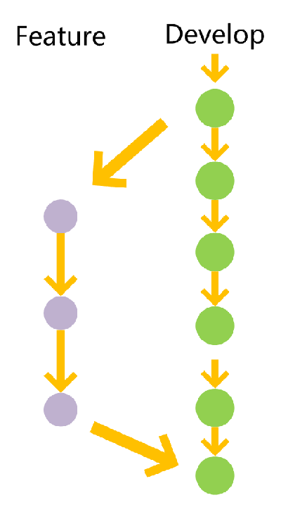

# 代码管理

## 一、主分支Master

首先，代码库应该有一个、且仅有一个主分支。所有提供给用户使用的正式版本，都在这个主分支上发布。 
  
Git主分支的名字，默认叫做Master。它是自动建立的，版本库初始化以后，默认就是在主分支在进行开发。


## 二、开发分支Develop

主分支只用来分布重大版本，日常开发应该在另一条分支上完成。我们把开发用的分支，叫做Develop。  
  
这个分支可以用来生成代码的最新隔夜版本（nightly）。如果想正式对外发布，就在Master分支上，对Develop分支进行"合并"（merge）。

Git创建Develop分支的命令：
```bash
　git checkout -b develop master
```
将Develop分支发布到Master分支的命令：
```bash
　　# 切换到Master分支
　　git checkout master

　　# 对Develop分支进行合并
　　git merge --no-ff develop
```

注意: 上一条命令的--no-ff参数是什么意思。默认情况下，Git执行"快进式合并"（fast-farward merge），会直接将Master分支指向Develop分支。  
    
使用--no-ff参数后，会执行正常合并，在Master分支上生成一个新节点。为了保证版本演进的清晰，我们希望采用这种做法。  
    

## 三、临时性分支 
前面讲到版本库的两条主要分支：Master和Develop。前者用于正式发布，后者用于日常开发。其实，常设分支只需要这两条就够了，不需要其他了。

但是，除了常设分支以外，还有一些临时性分支，用于应对一些特定目的的版本开发。临时性分支主要有三种：  
```
　　* 功能（feature）分支

　　* 预发布（release）分支

　　* 修补bug（fixbug）分支
```
这三种分支都属于临时性需要，使用完以后，应该删除，使得代码库的常设分支始终只有Master和Develop。  

## 四、 功能分支
接下来，一个个来看这三种"临时性分支"。

第一种是功能分支，它是为了开发某种特定功能，从Develop分支上面分出来的。开发完成后，要再并入Develop。  
    
功能分支的名字，可以采用feature-*的形式命名。

创建一个功能分支：
```bash
　git checkout -b feature-x develop
```
开发完成后，将功能分支合并到develop分支：
```bash
　git checkout develop

　　git merge --no-ff feature-x
```
删除feature分支：
```bash
　git branch -d feature-x
```
## 五、预发布分支
第二种是预发布分支，它是指发布正式版本之前（即合并到Master分支之前），我们可能需要有一个预发布的版本进行测试。

预发布分支是从Develop分支上面分出来的，预发布结束以后，必须合并进Develop和Master分支。它的命名，可以采用release-*的形式。

创建一个预发布分支：
```bash
　　git checkout -b release-1.2 develop
```
确认没有问题后，合并到master分支：
```bash
　　git checkout master

　　git merge --no-ff release-1.2

　　# 对合并生成的新节点，做一个标签
　　git tag -a 1.2
```
再合并到develop分支：
```bash
    git checkout develop
    git merge --no-ff release-1.2
```
最后，删除预发布分支：
```bash
　　git branch -d release-1.2
```
## 六、修补bug分支
最后一种是修补bug分支。软件正式发布以后，难免会出现bug。这时就需要创建一个分支，进行bug修补。

修补bug分支是从Master分支上面分出来的。修补结束以后，再合并进Master和Develop分支。它的命名，可以采用fixbug-*的形式。  

创建一个修补bug分支：
```bash
　git checkout -b fixbug-0.1 master
```
修补结束后，合并到master分支：
```bash
　　git checkout master

　　git merge --no-ff fixbug-0.1

　　git tag -a 0.1.1
```
再合并到develop分支：
```bash
　git checkout develop

　　git merge --no-ff fixbug-0.1
```
最后，删除"修补bug分支"：
```bash
　　git branch -d fixbug-0.1
```